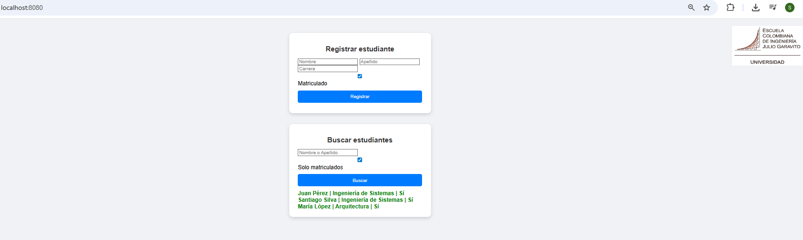
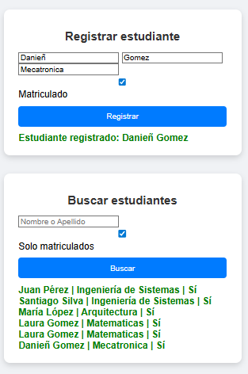
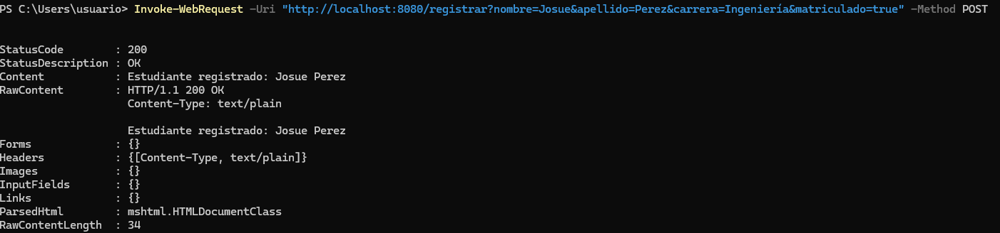
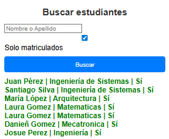

# Taller 1 - Servidor HTTP para Gestión de Estudiantes Universitarios 🏛️

Un servidor HTTP ligero desarrollado en Java que permite registrar y consultar estudiantes de una universidad.

## Características principales

- El servidor es capaz de leer archivos del disco local y retornar todos los archivos solicitados, incluyendo páginas html, archivos java script, css e imágenes
- Soporte para HTTP GET y HTTP POST
- Pruebas unitarias integradas

## 🔧 Instalación y Ejecución


```
# 1. Clona el repositorio
git clone https://github.com/SantiagoSilva200/Taller1AREP

# 2. Navega al directorio del proyecto
cd Taller1AREP

# 3. Compila el proyecto
mvn clean install

# 4. Ejecuta el servidor
mvn exec:java -Dexec.mainClass="co.edu.eci.arep.HttpServer"

```

Una vez ejecutado, abrir: http://localhost:8080

## Interfaz 

El sistema ofrece una interfaz web intuitiva donde se puede:

- Registrar nuevos estudiantes (nombre y carrera)
- Buscar estudiantes existentes
- Visualizar todos los registros




Haremos una prueba de funcionamiento rapidamente, agregue a el estudiante "Danieñ Gomez" del programa de mecatronica y lo registre, y luego, en la busqueda de estudiantes notamos que se creo correctamente. 



## Pruebas

Ejecuta las pruebas unitarias con:

```
mvn test

```


## Pruebas GET y POST

Para consumir la API y verificar registros hechos anteriormente o para hacer nuevos registros, use el comando "curl" desde una nueva terminal para verificar que este funcionando correctamente. 

Hice dos busquedas, para verificar el GET con usuarios que habia creado previamente ("Juan" y "Santiago") y vemos que la respuesta de la peticion es correcta. 


Por otro lado, use el siguiente comando que es para hacer una peticion POST desde Powershell: 



Y observamos desde la interfaz que se creo correctamente. 



## Arquitectura del Sistema

El proyecto implementa una arquitectura **cliente-servidor** con las siguientes características clave:

| Componente               | Descripción                                                                 |
|--------------------------|-----------------------------------------------------------------------------|
| **Servidor HTTP ligero** | Implementado completamente en Java sin frameworks pesados                  |
| **Endpoints dinámicos**  | Manejan la lógica de negocio para registro y consulta de estudiantes       |
| **Servicio estático**    | Sirve páginas HTML, CSS y recursos para la interfaz web                     |
       
## Autor

Taller desarrollado por Santiago Silva Roa 