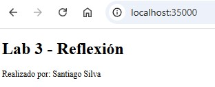
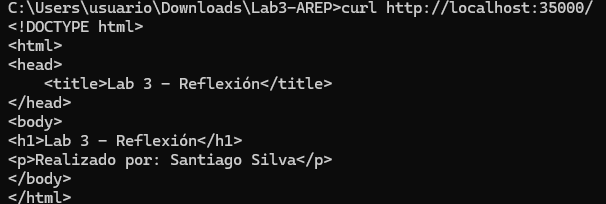
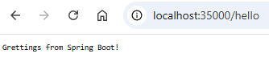
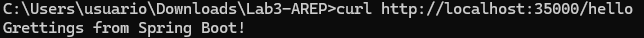
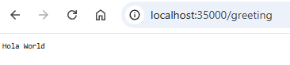
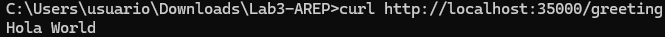
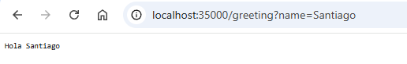
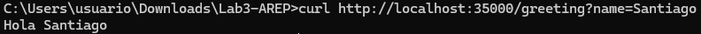
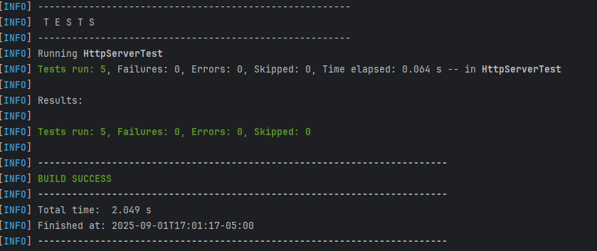

## MicroFramework Spring Boot - Laboratorio 3

Microframework web desarrollado en Java que implementa un servidor HTTP con capacidades de reflexión para la construcción de aplicaciones web a partir de POJOS. El framework permite la detección automática de componentes mediante anotaciones, soporta servicios REST y entrega de archivos estáticos.

## Caracteristicas 

Reflexión automática para detección de componentes

Anotaciones personalizadas: @RestController, @GetMapping, @RequestParam

Soporte para parámetros en endpoints con valores por defecto

Servicio de archivos estáticos (HTML, CSS, imágenes)

IoC básico para inyección de dependencias

## Instalación y Ejecución

```
# 1. Clonar el repositorio
git clone https://github.com/SantiagoSilva200/Lab3-AREP

# 2. Navegar al directorio del proyecto
cd Lab3-AREP

# 3. Compilar el proyecto
javac -d target -cp src/main/java src/main/java/co/edu/eci/arep/*.java src/main/java/co/edu/eci/arep/annotations/*.java


# 4. Ejecuta el servidor
java -cp target co.edu.eci.arep.MicroSpringBoot

```
Una vez ejecutado, abrir: http://localhost:35000


## Endpoints disponibles

##### GET / 

Retorna la página estática principal del servidor.

##### 2. GET /hello 

Retorna "Greetings from Spring Boot!"


##### 3 .GET /greeting

##### Sin parámetros:

/greeting → "Hola World"

##### Con parametro 'name': 

/greeting?name=Santiago → "Hola Santiago"


## Prueba funcionamiento endpoints

#### GET / 

##### Servidor 



##### Usando Curl 



#### GET /hello

##### Servidor 



##### Usando Curl 



#### GET /greeting 

##### Servidor 



##### Usando Curl 



#### GET /greeting?name=Santiago

##### Servidor 



##### Usando Curl 



### Funcionamiento del Framework

1. Detección Automática de Componentes
El framework explora automáticamente el classpath buscando clases anotadas con @RestController o @Component.

2. Registro de Endpoints
Detecta métodos anotados con @GetMapping y registra las rutas correspondientes.

3. Manejo de Parámetros
Soporta parámetros de consulta mediante @RequestParam con valores por defecto.

4. Servicio de Archivos Estáticos
Sirve archivos HTML, CSS, JS e imágenes desde la carpeta webroot.

## Tests

En la realizacion del laboratorio, realice 5 pruebas para probar el correcto funcionamiento del servidor y los nuevos requerimientos del 
taller. Para ejecutarlos, desde la terminal del IDE ejecutar: 

```
mvn test 

```


## Tecnologías

Java 17 + 

Protocolo HTTP/1.1

Maven para gestión de build y pruebas

Anotaciones Personalizadas 

## Autor

Taller desarrollado por Santiago Silva Roa 