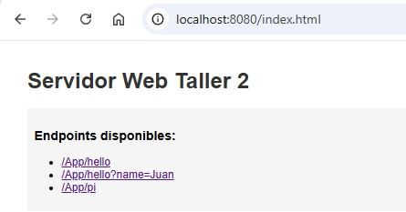
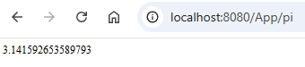
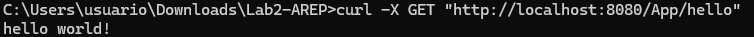
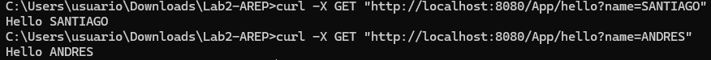
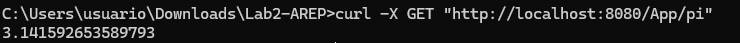
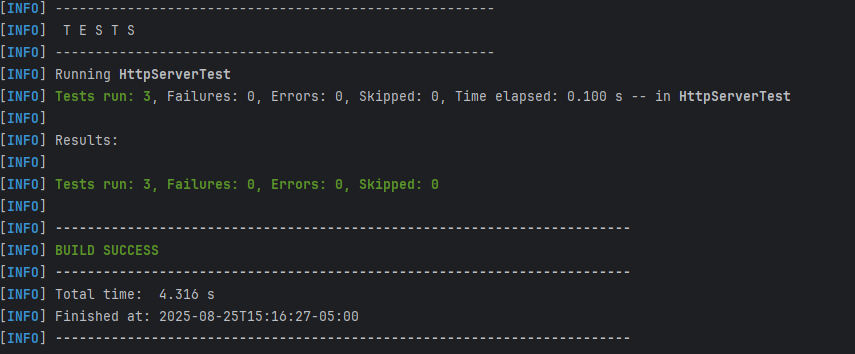
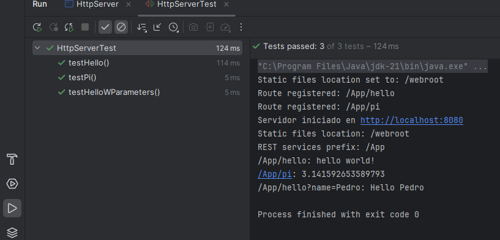

## Microframework Web para Servicios REST

Este microframework web desarrollado en Java transforma un servidor HTTP básico en un framework completo para aplicaciones web con servicios REST. Permite definir endpoints mediante funciones lambda, manejar parámetros de consulta y servir archivos estáticos de manera eficiente.

## Instalación y Ejecución

```
# 1. Clonar el repositorio
git clone https://github.com/SantiagoSilva200/Taller1AREP

# 2. Navegar al directorio del proyecto
cd Lab2-AREP

# 3. Compilar el proyecto
mvn clean compile

# 4. Ejecuta el servidor
mvn exec:java -Dexec.mainClass="co.edu.eci.arep.HttpServer"

```
Una vez ejecutado, abrir: http://localhost:8080

## Interfaz 

Servidor HTTP desarrollado en Java que funciona como microframework web, permitiendo crear servicios REST de manera sencilla y servir archivos estáticos.



#### Endpoints disponibles

##### 1. GET /App/hello → Retorna "hello world!"

##### 2. GET /App/hello?name=Juan → Retorna "Hello Juan"

##### 3 .GET /App/pi → Retorna el valor de π (3.141592653589793)

### Prueba funcionamiento endpoints

#### Hello 


#### Hello "name"


#### Pi



A continuacion, se muestra que los endopoints responden de manera correcta desde el servidor, sin embargo, usaremos el comando "curl -X GET" para obtener los mismos valores en consola. 








## Pruebas

Ejecuta las pruebas unitarias con:

```
mvn test

```


## Pruebas automatizadas 

Realice pruebas automatizadas, generalmente cuando inicia el servidor se ejecutan 3 pruebas automaticamente .



## Tecnologías

Java 11 + 

Protocolo HTTP/1.1

Maven para gestión de build

JUnit para pruebas unitarias

## Autor

Taller desarrollado por Santiago Silva Roa 